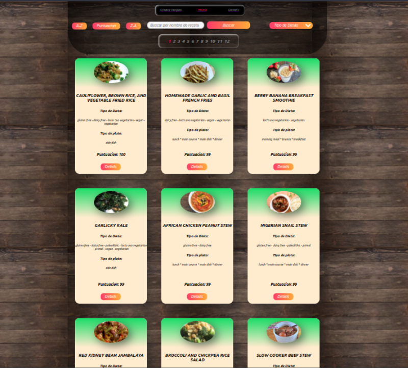

<div id="top"></div>
<!--
*** Thanks for checking out the Best-README-Template. If you have a suggestion
*** that would make this better, please fork the repo and create a pull request
*** or simply open an issue with the tag "enhancement".
*** Don't forget to give the project a star!
*** Thanks again! Now go create something AMAZING! :D
-->


<!-- PROJECT SHIELDS -->
<!--
*** I'm using markdown "reference style" links for readability.
*** Reference links are enclosed in brackets [ ] instead of parentheses ( ).
*** See the bottom of this document for the declaration of the reference variables
*** for contributors-url, forks-url, etc. This is an optional, concise syntax you may use.
*** https://www.markdownguide.org/basic-syntax/#reference-style-links
-->
<!--
[![Contributors][contributors-shield]][contributors-url]
[![Forks][forks-shield]][forks-url]
[![Stargazers][stars-shield]][stars-url]
[![Issues][issues-shield]][issues-url]
[![MIT License][license-shield]][license-url]
[![LinkedIn][linkedin-shield]][linkedin-url]
-->


<!-- PROJECT LOGO -->

<br />
<div align="center">
  <h1 align="center">FOOD</h1>
  
</div>

<!-- ABOUT THE PROJECT -->
## About The Project

(https://example.com)


<!-- GETTING STARTED -->
## Getting Started

La idea general es crear una aplicación en la cual se puedan ver distintas recetas de comida junto con información relevante de las mismas utilizando la api externa [spoonacular](https://spoonacular.com/food-api) y a partir de ella poder, entre otras cosas:

- Buscar recetas
- Filtrarlos / Ordenarlos
- Crear nuevas recetas propias


__IMPORTANTE__: Para poder utilizar esta API externa es necesario crearse una cuenta para obtener una API Key que luego debera ser incluida en todos los request que hagamos a spoonacular simplemente agregando `?apiKey={YOUR_API_KEY}` al final de cada endpoint. Agregar la clave en el archivo `.env` para que la misma no se suba al repositorio por cuestiones de seguridad y utilizarla desde allí. Por otro lado tienen un límite de requests por día por lo que usenlos con cuidado!

### Prerequisites

 * __Node__: 12.18.3 o mayor
 * __NPM__: 6.14.16 o mayor
 

### Installation

Iniciar node en las carpetas api y client con:

*npm 
```sh
npm init --yess
```

Ademas debe generar un archivo `.env` en la carpeta API donde:

```.env
DB_USER= nombre_user
DB_PASSWORD= password
DB_HOST= localhost
DB_NAME= nombre_basedato
apiKey= key que te otorga la api al crear la cuenta
url =https://api.spoonacular.com/recipes/complexSearch?&addRecipeInformation=true&number=100&apiKey=
```

### Initiation:

__Api__ and __Client__:
*npm 
```sh
npm start
```


